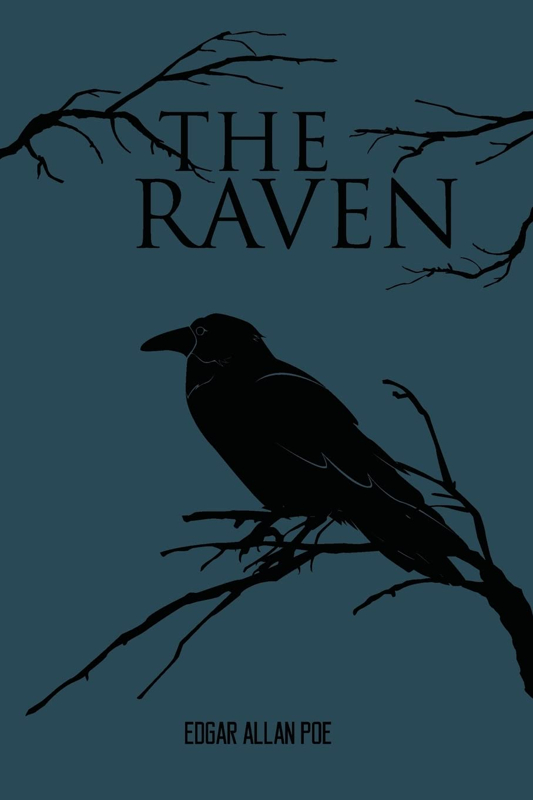

<h1 align="center">Proyecto: Análisis del Poema "El Cuervo" de Edgar Allan Poe</h1>

<p align="center">
  
</p>

## 🔄 Cómo clonar y ejecutar este proyecto

```bash
# Clonar el repositorio
git clone https://github.com/Pipe199x/TheRaven.git

# Ingresar a la carpeta del proyecto
cd TheRaven
```

## ⚙️ Pasos para Configurar el Ambiente

1. **Crear un ambiente virtual (opcional, pero recomendado):**
   ```bash
   python -m venv venv
   source venv/bin/activate  # En macOS/Linux
   venv\Scripts\activate   # En Windows
   ```

2. **Instalar los requerimientos:**
   ```bash
   pip install -r requirements.txt
   ```

3. **Descargar el modelo de idioma en spaCy:**
   ```bash
   python -m spacy download es_core_news_sm
   ```

4. **Instalar el controlador de Chromium (si es necesario en Linux):**
   ```bash
   sudo apt install -y chromium-chromedriver
   ```

## 📁 Archivos en el Proyecto

- `requirements.txt`: Lista de dependencias necesarias.
- `Edgar_Allan_Poe_El_Cuervo.ipynb`: Notebook con el código de extracción y análisis.
- `TheRaven.jpg`: Imagen relacionada con el poema.
- `RavenReadMe.jpg`: Imagen usada en este README.
- `TheRavenWordCloud.png`: Nube de palabras generada a partir del poema.
- `Readme.md`: Este archivo.

## 🚀 Uso

Ejecuta el notebook en un entorno de Jupyter para procesar y analizar el poema.  
Podrás visualizar una nube de palabras y gráficos generados a partir del contenido.